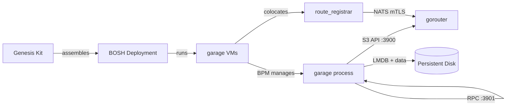

# garage-genesis-kit

A Genesis kit for deploying [Garage](https://garagehq.deuxfleurs.fr/), a lightweight, S3-compatible distributed object storage system, using BOSH.

## Overview

This kit deploys Garage v1.3.1 under BPM, with optional CF route registration via `route_registrar`. Each BOSH VM runs a single Garage node backed by a persistent disk. Cluster formation is automatic on first deploy and idempotent on subsequent deploys.



## Features

| Feature | Description |
|---------|-------------|
| `cluster` | Scale to 3+ nodes with BOSH link-based peer discovery and auto layout bootstrap |
| `route-registrar` | Register `s3-api.<system-domain>` into CF gorouter via NATS mTLS |
| `ocfp` | Derive network, VM type, and disk type names from OCFP naming conventions |
| `scale-small` | Use small VM type and disk type |
| `scale-medium` | Use medium VM type and disk type |
| `scale-large` | Use large VM type and disk type |
| `upgrade-serial` | Rolling upgrade: one instance at a time, canary first |
| `upgrade-all-at-once` | Upgrade all instances simultaneously |

## Quick Start

```bash
# Create a new environment
genesis new my-garage-env

# Edit the generated environment file
$EDITOR envs/my-garage-env.yml

# Deploy
genesis deploy my-garage-env
```

## Properties

The following parameters can be set in your environment file under `params:`.

| Parameter | Default | Description |
|-----------|---------|-------------|
| `instances` | `1` | Number of Garage nodes (use `cluster` feature for 3+) |
| `garage_network` | `garage` | BOSH network name |
| `garage_vm_type` | `default` | BOSH VM type |
| `garage_disk_type` | `default` | BOSH persistent disk type |
| `garage_route_prefix` | `s3-api` | Route prefix (produces `<prefix>.<system-domain>`) |
| `availability_zones` | `[z1, z2, z3]` | BOSH AZs to spread instances across |

## Addons

Run addons with `genesis <env> do <addon>`.

| Addon | Shortcut | Description |
|-------|----------|-------------|
| `smoke` | `s` | Run the smoke-tests BOSH errand against the deployment |
| `reset-credentials` | `r` | Rotate `rpc_secret` and `admin_token` in Vault |
| `mc` | `m` | Print `mc alias set` command for CLI access |

## Cluster Bootstrap

On first deploy, the post-deploy hook on instance index 0 calls `garage layout assign` for each unassigned node, then `garage layout apply`. This is idempotent — subsequent deploys skip the bootstrap because no nodes are in the `NO ROLE ASSIGNED` state.

Set `params.garage_layout_manual: true` to opt out of automatic bootstrap and manage cluster layout manually via the `mc` addon.

## Cloud-Provider Notes

**Azure**: The `azure` feature is applied automatically when the IaaS is Azure. It restricts deployment to a single AZ (`z1`) and adds `vm_extensions: [garage_as]` for VM availability set placement. Override the availability set name with `params.azure_availability_set`.

**STACKIT**: The `stackit` feature is applied automatically for STACKIT environments. It clears `vm_extensions` because STACKIT has no native availability set concept.

## Contributing

Pull requests are welcome. See [CONTRIBUTING.md](CONTRIBUTING.md) for the development workflow.

## License

Apache 2.0. Copyright 2026 Cloud Foundry Community. See [LICENSE](LICENSE).
